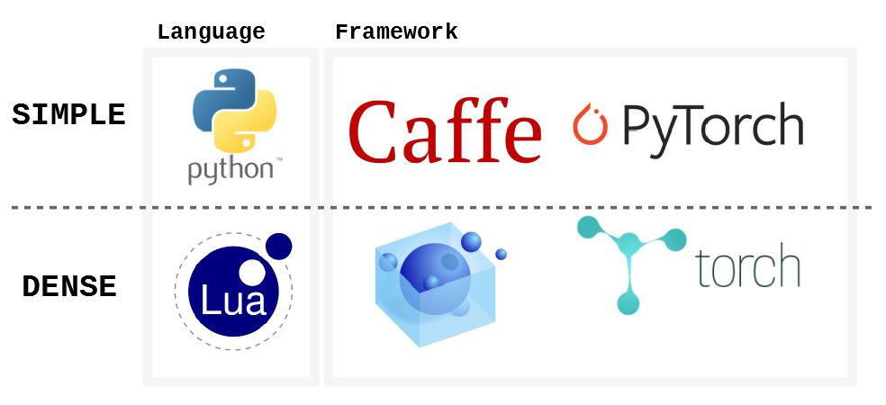

# 2. 개발/배포 환경

## Web / Mobile 개발 환경

* Windows 10, macOS 10.14.3, CentOS 7
* Docker, Virtualbox
* Python 3.6
* MariaDB, SQLite
* Visual Studio Code, Android Studio
* Sketch \([https://sketchapp.com](https://sketchapp.com)\)

## Machine Learning 개발 환경



* Python
* PyTorch
* Caffe



* Lua
* LuaRocks
* Torch



## 배포 환경

* Apache Tomcat 9.0
* Google Chrome

