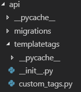

# 5-1. Django & Python

### Trouble 1.  Django template에 split 기능이 없음

#### 해결 방법 : Custom template filter를 만들어준다.

data.url은 회원번호\_저장된 시간\(ex. 1235323443\_2019-0515T14:02:25\)의 형태로 저장이 되어 있습니다. 

이 중 저희는 session에 저장되어 있는 회원 번호와 url에 저장되어 있는 회원번호가 일치할 경우, 공유하기 및 삭제하기 버튼을 보여주려 합니다.

* 먼저, api라는 앱에 templatetags라는 디렉토리를 생성하고, custom\_tags.py를 만들어줍니다. 



* custom\_tags.py 에 다음과 같이 코드를 한다. 



```python
from django import template
from django.template.defaultfilters import stringfilter
register = template.Library()

@register.filter(name='split')
def split(value, key):
    """
        Returns the value turned into a list.
    """
    return value.split(key)

@register.filter(name='trim')
@stringfilter

def trim(value):
    return value.
```



* 이제 코스텀된,  split filter를 template 에서 사용한다. notebook/home.html에 를 사용하여 필요한 부분만 이용하여 추출한다.



```python


    <button class="btn btn-custom2" id="btn-publish" onclick="javacript:updateData({{ data.idx }});"> 
    <i class="fas fa-users"></i><i class="fas fa-user"></i></i>
    </button>
                            
    <button class="btn btn-custom" id="btn-delete" onclick="javacript:delData({{ data.idx }});"><i class="fas fa-trash"></i></button> 

    
```



### Trouble 2. TTS 음성이 여러 개 쌓이는 문제


