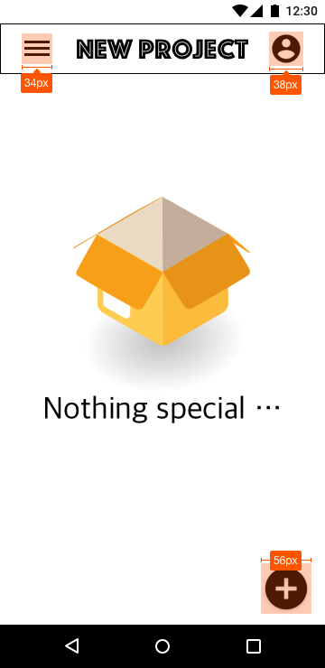

# 4-1. 프로토타입/모바일

### 1. 메인 페이지 - 업로드 내용이 없을 때

### 2. 메인 페이지 - 업로드 내용이 있을 때

### 3. 상세 페이지 1

사진 톤에 맞춰, 영문장이 출력되는 판넬의 톤 색이 결정됩니다.

### 3. 상세 페이지 2

사진 톤에 맞춰, 영문장이 출력되는 판넬의 톤 색이 결정됩니다.

### 4. 전체화면 - 세로

### 4. 전체화면 - 가로

