# 4-3. 화면 구성/웹

### 1. 로그인 화면

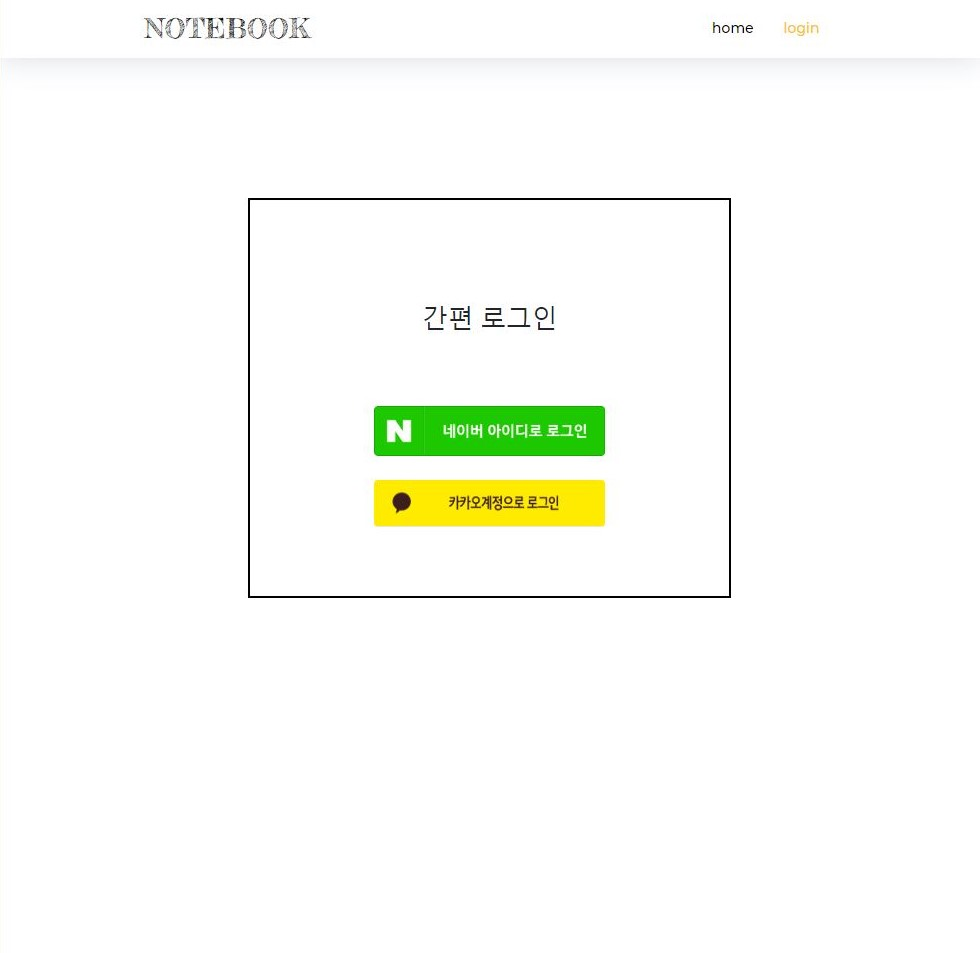

### 2. 메인-업로드한 사진이 없을 경우

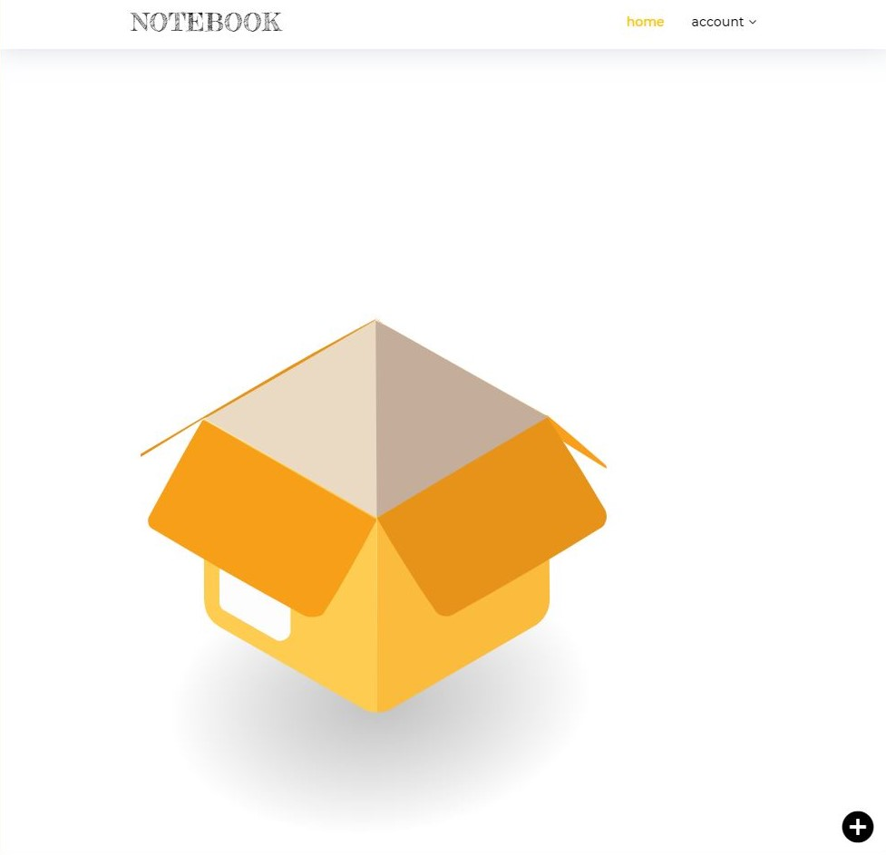

### 2-1. 메인-업로드한 사진이 있을 경우

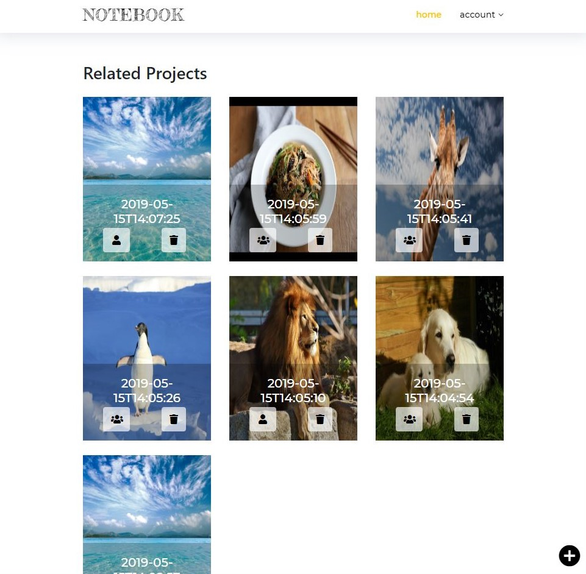

### 3. 파일 업로드

하단의 + 버튼을 눌러 파일을 업로드 합니다.

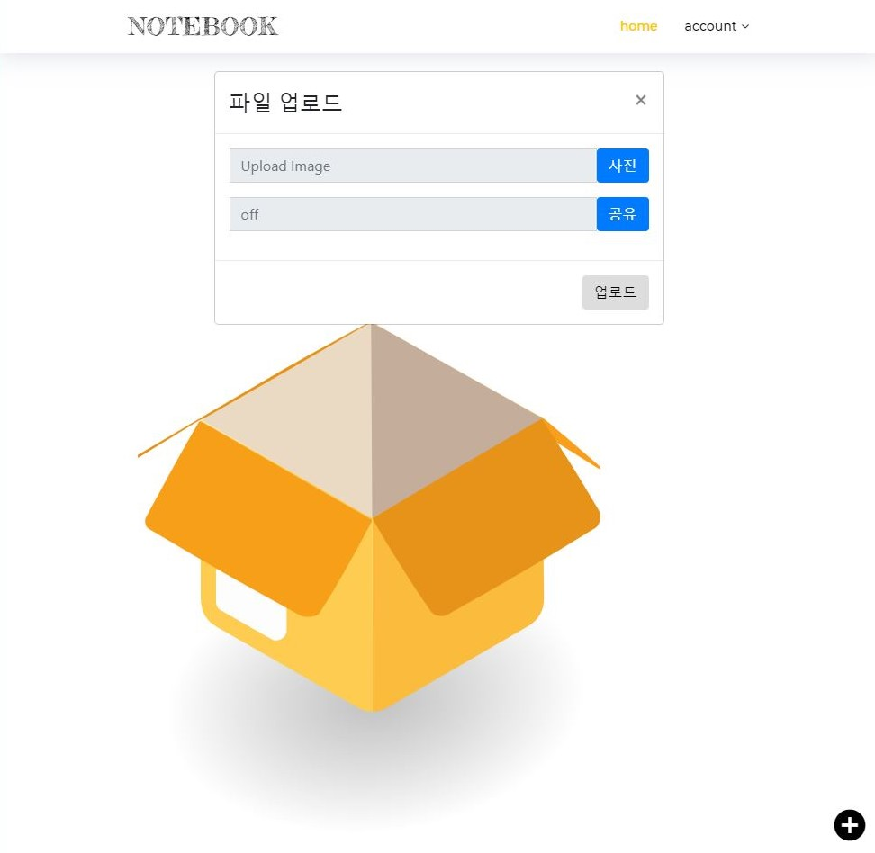

### 3-1. 파일 업로드-파일, 공유 여부 선택

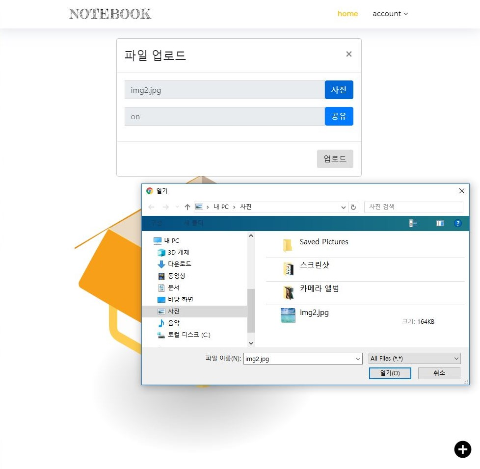

### 3-2. 파일 업로드-로딩중

Simple\(Machine Learning\)의 경우 10초 정도의 시간이 소요됩니다.  
Dense\(Machine Learning\)의 경우 10분 정도의 시간이 소요됩니다.

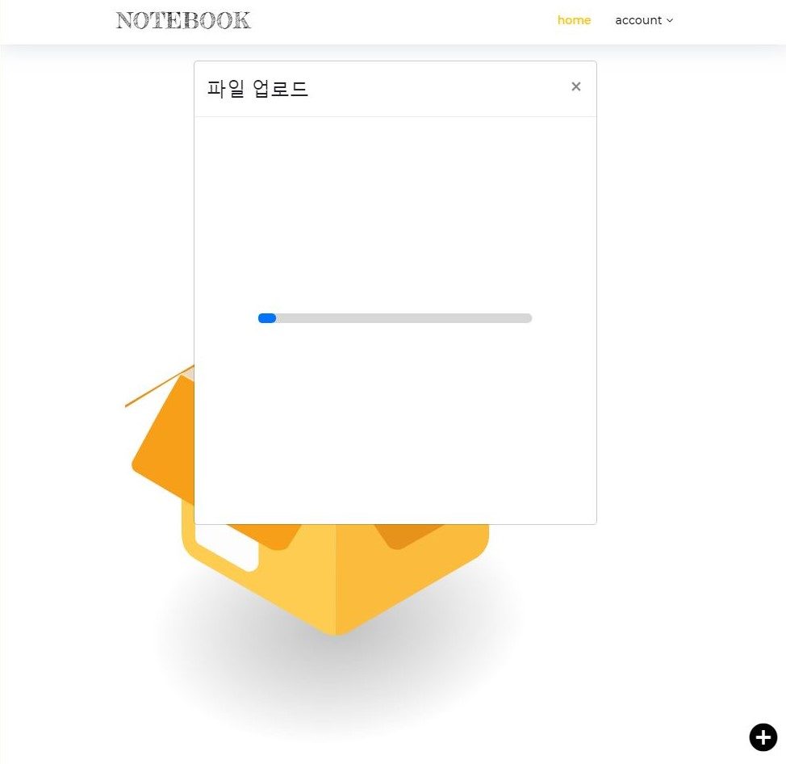

### 4. 파일 로드 성공 페이지

모달창을 닫을 경우, main 페이지로 redirect 됩니다.

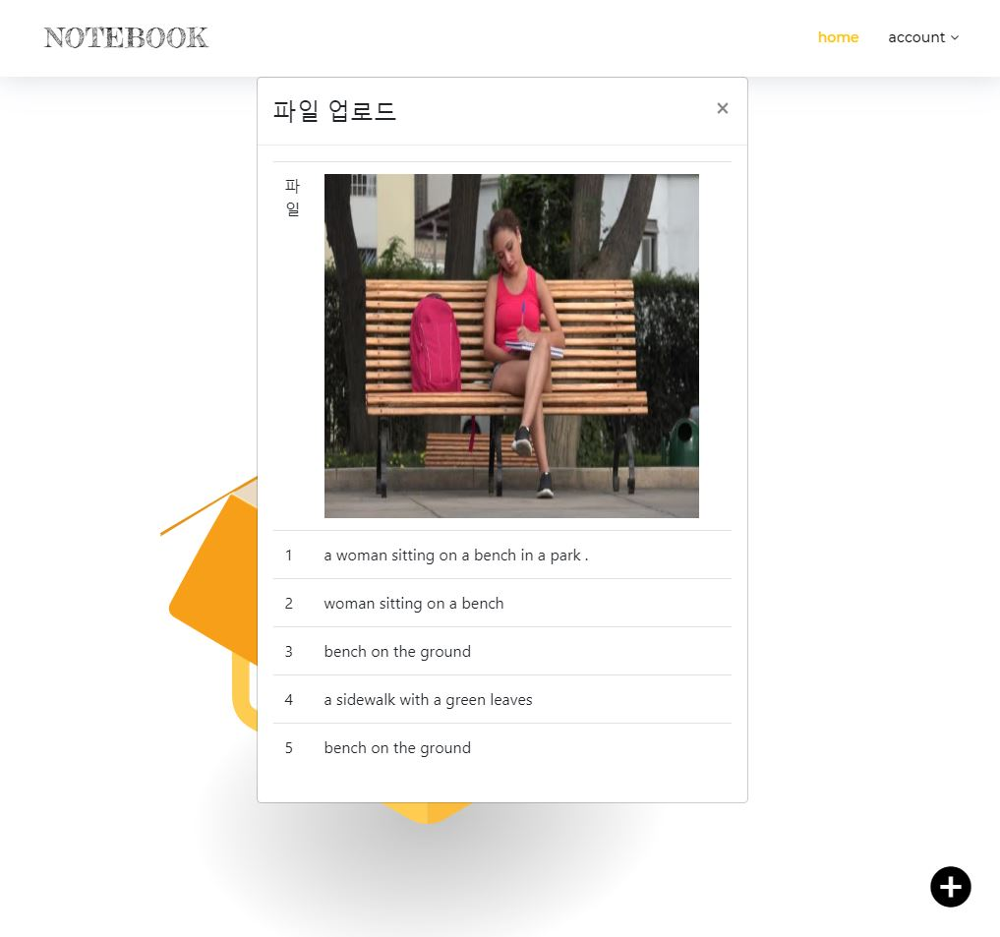

### 5. 상세페이지

* 추출 된 문장을 스크롤하여 선택할 수 있습니다.
* 음량 버튼을 누르면 문장을 읽어줍니다. -Chrome 내장 TTS 사용으로, 크롬 환경에서만 음성 서비스가 가능합니다.

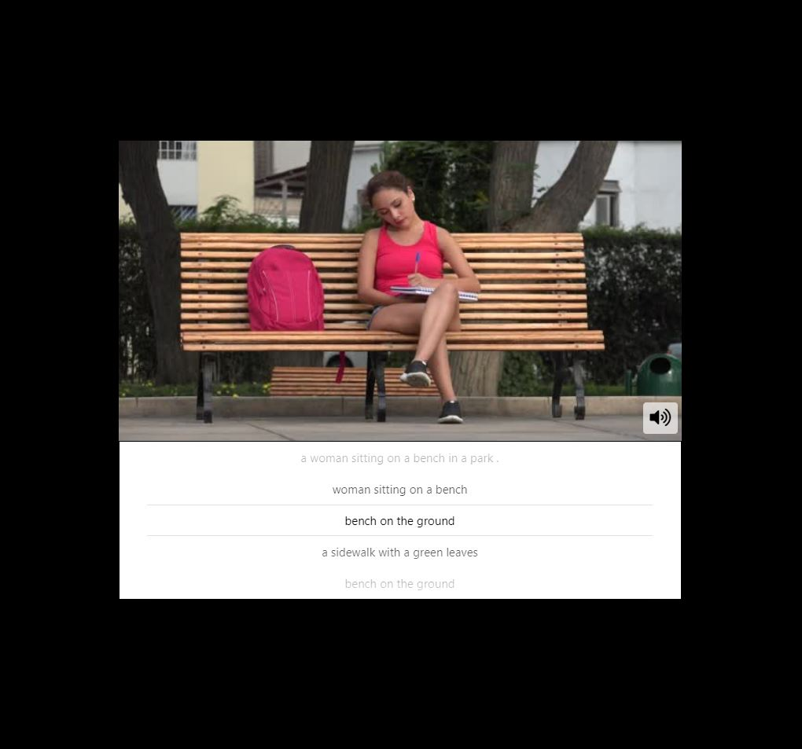

### 6-1. 반응형 웹-max-width 1120px

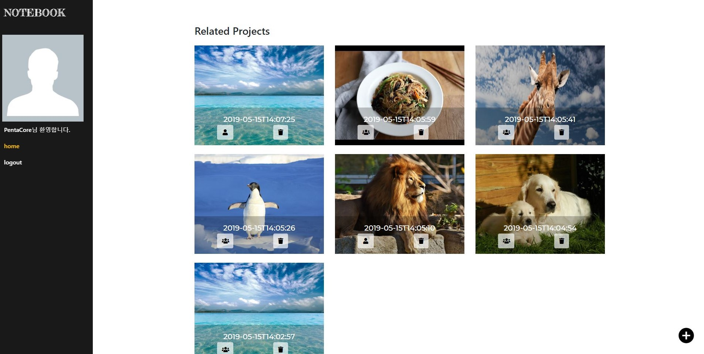

### 6-2. 반응형 웹-max-width 991px

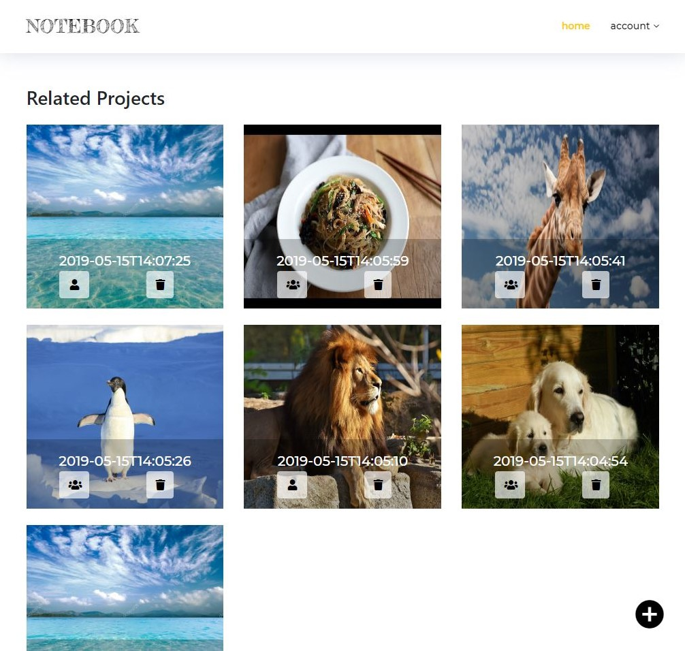

### 6-3. 반응형 웹-max-width 767px

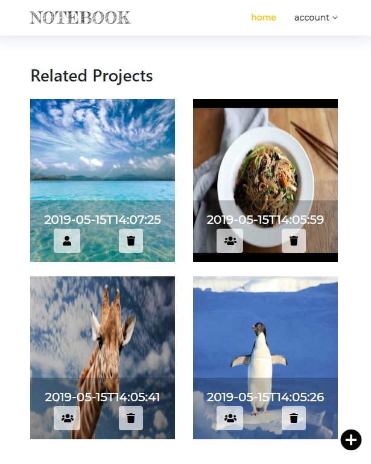

### 6-4. 반응형 웹-max-width 575px

### 7. 오류 페이지

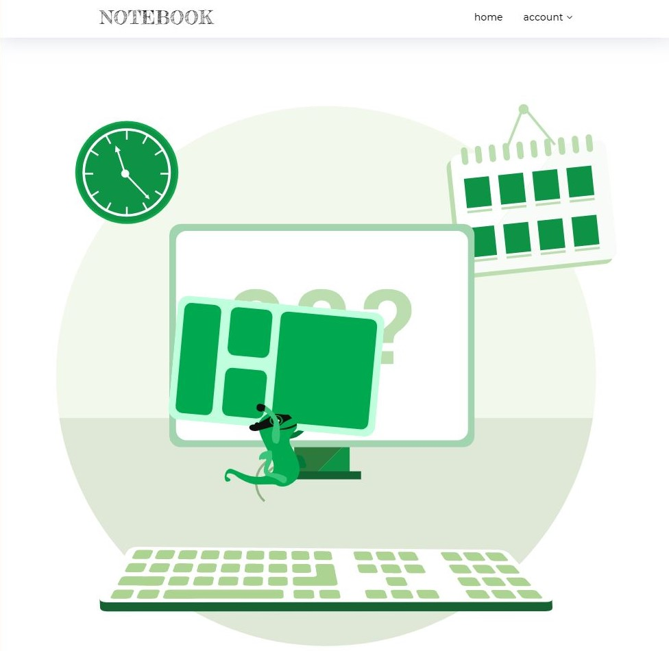

